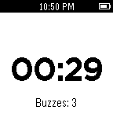

# Buzzer

Buzzer is a simple watchapp that vibrates the watch on a user-set interval. Simply start the app, set how many minutes you want between buzzes and go. The Buzzer watchapp will then tell you the time remaining before the next buzz and how many buzzes have passed. You can also press the Select button while the timer is running to pause it.

## Screenshots

